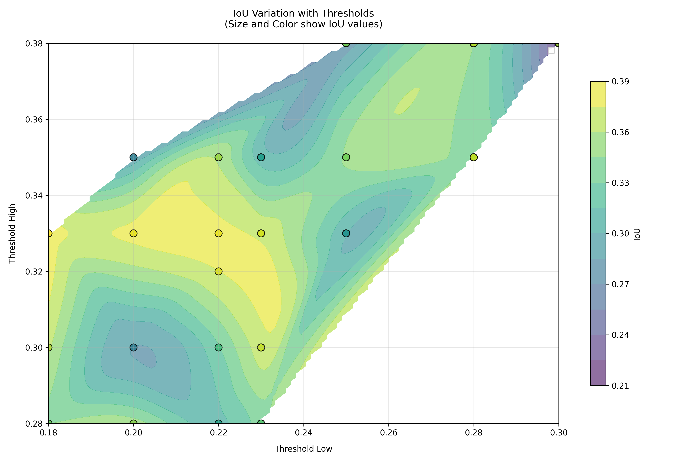

# Ablation Experiments

## CAM threshold grid search
### Experiment Overview
This project implements a systematic grid search for optimal CAM thresholds in weakly supervised pet segmentation. The experiment combines Grad-CAM++ pseudo-mask generation with SegNet training to evaluate threshold combinations.

### CAM Generation

Uses pretrained ResNet50-GradCAM++ to generate class activation maps

Threshold range: Focused search around optimal zone (0.25-0.325 base). This threshold is manually picked after testing performance against (0.3, 0.7), (0.15, 0.45), (0.2, 0.4), and (0.25, 0.375)

### Pseudo-mask Generation

Three-region mask generation:

High confidence (≥threshold_high)

Low confidence (≤threshold_low)

Uncertain (middle range)

### Refined Search Space

Focused grid around best candidate: ±0.025 offsets

Distribution-aware extensions:

Low: [0.18, 0.22, 0.28] (25th percentile region)

High: [0.30, 0.35, 0.38] (75th percentile extension)

Interval constraints: 0.05 < Δ < 0.15

### Model Training

SegNet architecture with AdamW optimizer

Step learning rate scheduling (γ=0.1 every 15 epochs)

3-class segmentation evaluation

Use 5 epochs to accelerate the search

### Result

Low threshold ~0.2 and high threshold ~0.33 achieved the best(But after testing with 10 epochs, 0.25-0.325 still better)

## Overall Hyperparameter Tweaking

# Grid Search Configuration

 grid search procedure for hyperparameter tuning in weakly supervised segmentation experiments using Class Activation Maps (CAM).

### Hyperparameter Search Space(WIP)

| Parameter Category       | Options                                                                 |
|--------------------------|-------------------------------------------------------------------------|
| **CAM Thresholds**        | `(0.25, 0.325)`, `(0.2, 0.4)`, `(0.15, 0.45)`, `(0.3, 0.7)`, `(0.21, 0.33)` |
| **Loss Functions**         | `CrossEntropyLoss`, `DiceLoss`                                         |
| **Optimizers**            | `AdamW(lr=1e-3, wd=1e-4)`, `AdamW(lr=1e-2, wd=1e-4)`                   |
| **Learning Rate Schedulers** | `StepLR(step_size=15, gamma=0.1)`                                     |
| **Batch Sizes**           | `32`,`64`                                                |

### Procedure

1. Load pretrained classifier
2. Compute pseudo masks
3. run segmentation network
4. record performance agains test set with true labels

### Result(WIP)

