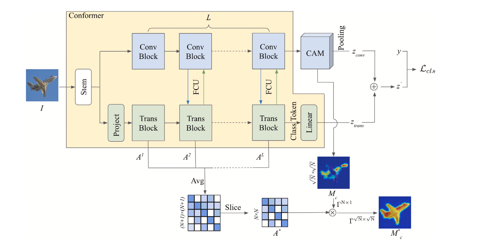

# Literature review

## MRQ

### specific problem
Formulate a specific weak supervision problem to address and justify its usefulness and feasibility

- Reduce reliance on pixel-level supervision, while maintaining competitive segmentation accuracy.
- Interactive segmentation

### models

#### CAM

Definition: Uses the Global Average Pooling (GAP) layer of CNNs to generate class activation maps that locate target regions.

Principle: The GAP layer compresses spatial information from feature maps into channel weights, which are then weighted and summed to produce heat maps.

- CVPR2016: Learning Deep Features for Discriminative Localization
- ICCV2017: Grad-CAM: Visual Explanations from Deep Networks via Gradient-based Localization

##### based on CAM

1. Pseudo-label generation based on image-level labels
   - MICCAI 2019: AffinityNet: Semi-Supervised Few-Shot Learning for Disease Type Prediction
2. Transformer-driven weakly supervised segmentation
   - conformer: NeurIPS 2023: TransCAM: Transformer-based Class Activation Maps for Weakly Supervised Segmentation(https://github.com/liruiwen/TransCAM)
   
   - vit: ICCV 2021: TS-CAM: Token Semantic Coupled Attention Map for Weakly Supervised Object Localization(https://github.com/vasgaowei/TS-CAM)
   - CVPR 2022: Multi-class Token Transformer for Weakly Supervised Semantic Segmentation
   - CVPR 2022:  Learning Affinity From Attention: End-to-End Weakly-Supervised Semantic Segmentation With Transformers(framework is a bit complex)
3. CAM+UNET(less implementation?)
   - ICCV 2021: Weakly Supervised Semantic Segmentation via Adversarial Learning of Class-aware Local Enhancement

training transformer is expensive. are we allowed to finetune pre-trained vit?

#### box-supervised segmentation

Utilizes bounding box annotations to generate pixel-level pseudo labels (such as foreground inside the box, background outside the box).

- CVPR2021: BoxInst: High-Performance Instance Segmentation with Box Annotations
   - add two loss on the fully-supervised solution: Projection and Pairwise Affinity(might be easy to compare)
- ICCV2023: SimpleClick: Interactive Image Segmentation with Simple Vision Transformers(https://github.com/uncbiag/SimpleClick)

Oxford-IIIT Pet has bounding box annotation

#### based on bounding box
- bounding box + transformer
   - CVPR 2022 BoxeR: Box-Attention for 2D and 3D Transformers
   - CVPR 2023 BoxTeacher: Exploring High-Quality Pseudo Labels for Weakly Supervised Instance Segmentation

#### MIL

Definition: Views the entire image as a "bag" and local regions within the image (such as grids or superpixels) as "instances." If an image-level label is positive (e.g., "contains a cat"), then at least one instance is positive, but the specific location is unknown.

Objective: Infer pixel-level segmentation masks from image-level labels.

- CVPR2016: Weakly Supervised Semantic Segmentation Using Multi-Instance Learning
- CVPR2017: Object Region Mining with Adversarial Erasing

Limitations:
- Coarse region division: Directly flattening feature maps may lose spatial information, better suited for simple scenes.
- Only supports image-level classification: Requires post-processing (like CAM) to generate segmentation masks.
- Sensitivity of max pooling: If target regions are not activated (e.g., due to occlusion), it may lead to missed detections.

#### self-training

Utilizes pseudo labels predicted by the model itself to iteratively optimize the model.

- CVPR2020: Self-Training with Noisy Student Improves ImageNet Classification
- CVPR2023: UniMatch: A Unified Framework for Semi-Supervised and Weakly-Supervised Segmentation

#### consistency regularization

### implementatiom
Implement a weakly-supervised segmentation framework

### experiment

#### compare with fully-supervised methods

unet, deeplab, segformer(if we use transformer)

#### weak supervision configuration
hyperparameters

## OEQ

combined with foundation models?  https://segment-anything.com/

Hybrid Weak Supervision: Combines image-level and box annotations to balance global-local information.

#### for using transformer:
1. Text prompts or category name prompts as auxiliary for Transformer CAM(also for bounding box)

e.g., If text prompts related to 'cat' or 'dog' are introduced to the Transformer architecture during inference or training (such as multimodal alignment), could this further improve the CAM generated based on Transformer Attention?

