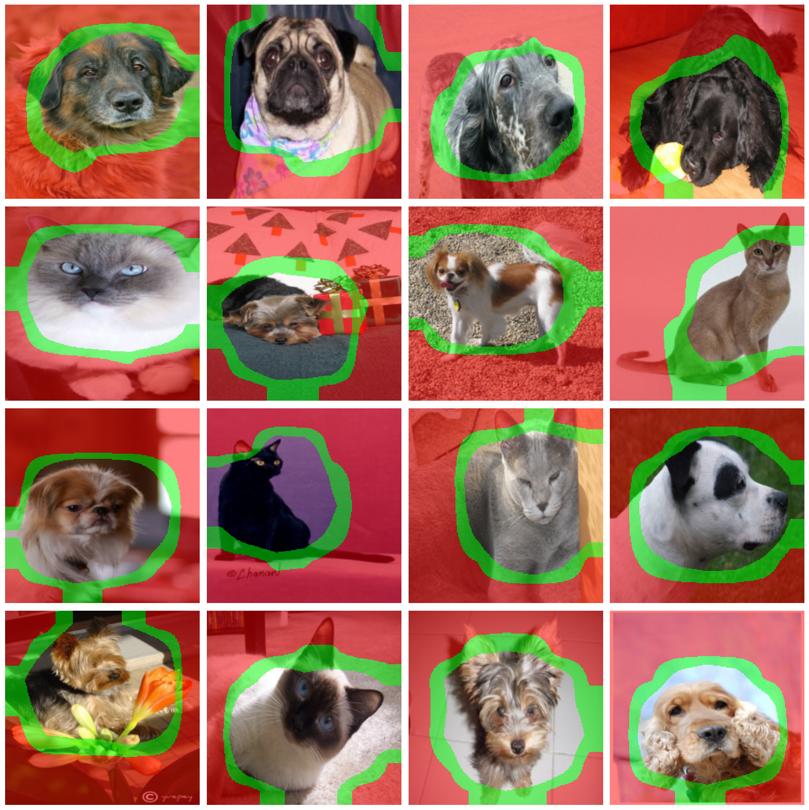
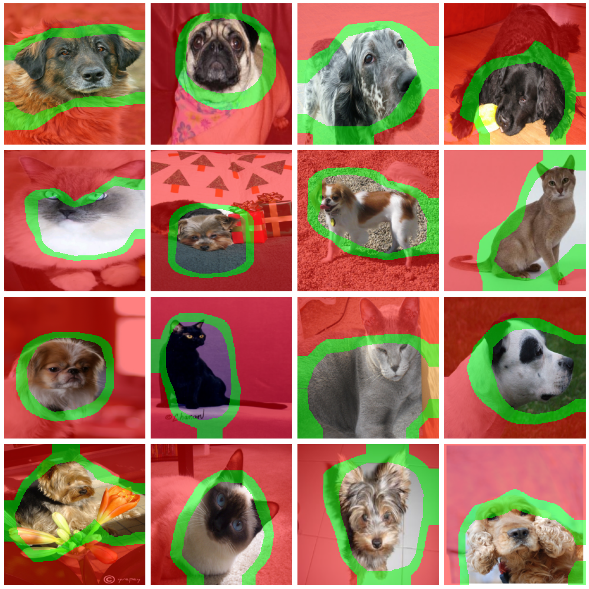
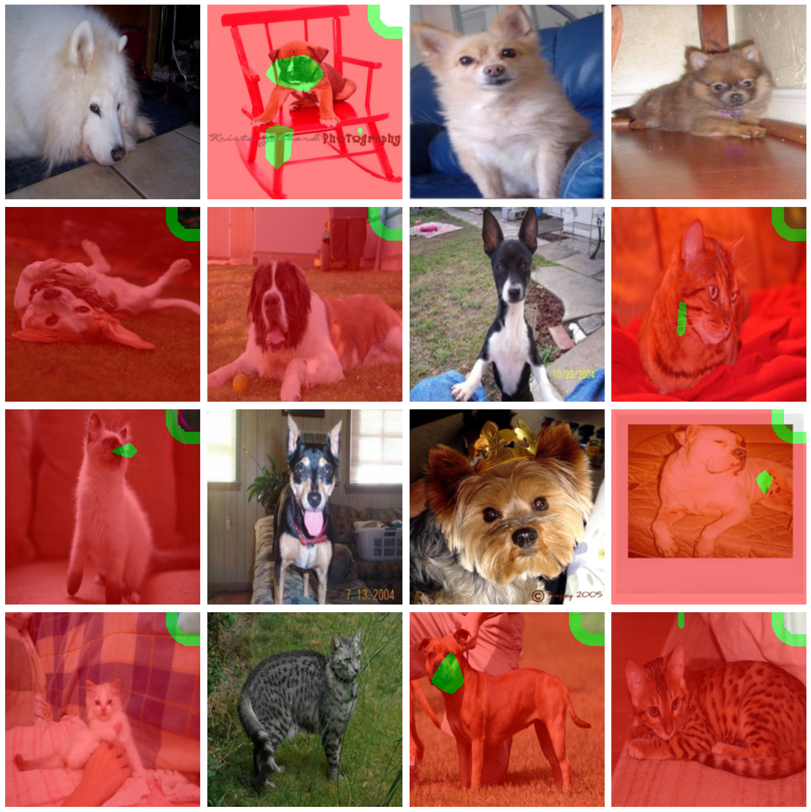
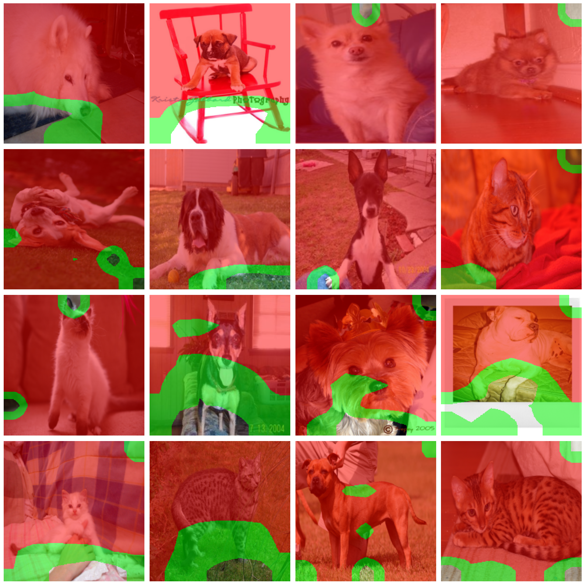

# Weakly segmentation performance

### resnet drs grandcam++ crm

threshold: [0.1, 0.3]



```!python -m model.train --model=segnet --pseudo_path=crm_models/resnet_drs_pet_gradcampp_crm_pseudo.pt --pseudo```

Best model found at epoch 8 with IoU **0.40659770369529724**
- Test -> {'loss': 1.565517783164978, 'accuracy': 0.6572912931442261, 'precision': 0.5365676879882812, 'recall': 0.5429167151451111, 'iou': 0.40659770369529724, 'dice': 0.5373595356941223} 
- Train -> {'loss': 0.2350560829691265, 'accuracy': 0.9005399597727735, 'precision': 0.8542830861133078, 'recall': 0.8510614218919174, 'iou': 0.7616126016430232, 'dice': 0.8519239044707755}

```!python -m model.train --model=effunet --pseudo_path=crm_models/resnet_drs_pet_gradcampp_crm_pseudo.pt --pseudo```

Best model found at epoch 9 with IoU 0.2364051342010498
- Test -> {'loss': 3.7052717208862305, 'accuracy': 0.40558359026908875, 'precision': 0.5335601568222046, 'recall': 0.4350345730781555, 'iou': 0.2364051342010498, 'dice': 0.3692573010921478} 
- Train -> {'loss': 0.1584420550128688, 'accuracy': 0.9313973476057468, 'precision': 0.8994415013686471, 'recall': 0.8972098687420721, 'iou': 0.825198089039844, 'dice': 0.8976621337558912}


### resnet grandcam++

threshold: [0.2, 0.4]



```!python -m model.train --model=segnet --pseudo_path=cam/saved_models/resnet50_pet_cam_pseudo.pt --pseudo```

Best model found at epoch 8 with IoU **0.4282523989677429**
Test -> {'loss': 1.0634000301361084, 'accuracy': 0.6698172092437744, 'precision': 0.5651554465293884, 'recall': 0.5712183117866516, 'iou': 0.4282523989677429, 'dice': 0.5625070333480835} 
Train -> {'loss': 0.36284619751183883, 'accuracy': 0.8439846088056979, 'precision': 0.785943395158519, 'recall': 0.7795819640159607, 'iou': 0.6685482242833013, 'dice': 0.781283473191054} 

```!python -m model.train --model=effunet --pseudo_path=cam/saved_models/resnet50_pet_cam_pseudo.pt --pseudo```

Best model found at epoch 10 with IoU 0.29671260714530945
Test -> {'loss': 5.688145160675049, 'accuracy': 0.6158372163772583, 'precision': 0.5035731792449951, 'recall': 0.41722607612609863, 'iou': 0.29671260714530945, 'dice': 0.4078591465950012} 
Train -> {'loss': 0.21230006302180499, 'accuracy': 0.9082173067590464, 'precision': 0.8738297418407772, 'recall': 0.8707732078821763, 'iou': 0.7850226570730624, 'dice': 0.8714195194451705}


### effnet scorecam




### effnet scorecam crm


